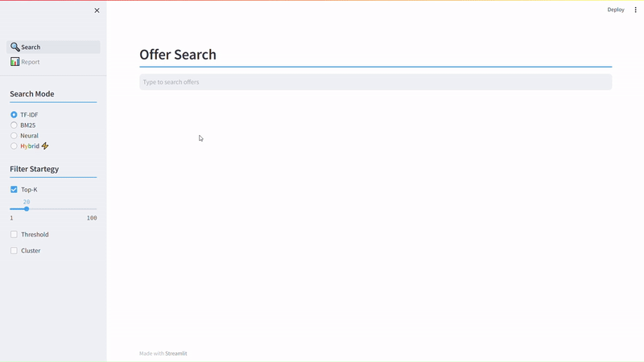

<!-- Header Start -->
<div align="center">

# Offer Search App

</div>
<!-- Header End -->

<div align="center">

[](https://github.com/95anantsingh/NYU-SuperGAN/blob/integrated/LICENSE) []() [](https://pytorch.org/)

</div>

<br>

## 📃 Dependencies
- [Anaconda](https://www.anaconda.com/download/#linux) or [Miniconda](https://docs.conda.io/en/latest/miniconda.html)
- Python = 3.10
- [PyTorch = 2.1.0](https://pytorch.org/)
- More in [requirements.txt](https://github.com/95anantsingh/search-app/blob/main/requirements.txt)

> Ideal setup requires a Graphic Card

<br>

## 🛠 Installation

1. Clone repo

    ```bash
    git clone https://github.com/95anantsingh/search-app.git
    ```

1. Create conda environment

    ```bash
    conda env create -f env.yml
    ```

1. Download NLTK Data

    ```bash
    python -m nltk.downloader punkt stopwords
    ```

<br>

## ⚡ Run App


```bash
cd search-app
conda activate search
streamlit run 🔍_Search.py
```

Now search for offers with options on the left to see results.



<br>

## 📘 Report

Project report can be found [here](https://github.com/95anantsingh/search-app/blob/main/pages/report.md) or you can find it in the app as well.

<br>

## 📁 Project Structure

| Folder Name                   | Description                            |
|----------------------         |----------------------------------------|
| .streamlit                    | Configuration files for Streamlit      |
| .vscode                       | Visual Studio Code settings and files  |
| core                          | Core application module                |
| ├─ base_search.py             | Base search class                      |
| ├─ bm25.py                    | BM25 search class                      |
| ├─ data_processor.py          | Data processing code                   |
| ├─ hybrid.py                  | Hybrid search class                    |
| ├─ __init__.py                | Initialization module                  |
| ├─ neural.py                  | Neural search class                    |
| ├─ offers_db.py               | Offers database class                  |
| ├─ tfidf.py                   | TF-IDF search class                    |
| data                          | Data used by the application           |
| ├─ processed                  | Processed data files                   |
| │   ├─ database.sqlite        | Offers SQLite database                 |
| │   ├─ syn_queries.json       | Synthetic queries                      |
| │   ├─ true_scores.csv        | True scores (CSV)                      |
| │   ├─ true_scores_gold.csv   | True scores (gold) (CSV)               |
| │   └─ true_scores_syn.csv    | True scores (synthetic) (CSV)          |
| └─ raw                        | Raw data files                         |
| notebooks                     | Jupyter Notebook files                 |
| ├─ eval.ipynb                 | Evaluation notebook                    |
| ├─ queries.ipynb              | Query Generation notebook              |
| └─ search_exp.ipynb           | Search experiment Notebook             |
| vectors                       | Vector Database files                  |
| ├─ bm25                       | BM25 model files                       |
| ├─ neural                     | Neural model files                     |
| │   └─ retrieval              | FAISS Vector Database Files            |
| └─ tfidf                      | TF-IDF files                           |
| pages                         | Application web pages                  |
| 🔍_Search.py                  | Streamlit App File                     |
| env.yml                       | Environment configuration file         |
| README.md                     | Repository README file                 |
| requirements.txt              | Python package requirements            |

<br>

## 📧 Contact

If you have any question, please email [`anant.singh@nyu.edu`](mailto:anant.singh@nyu.edu)
