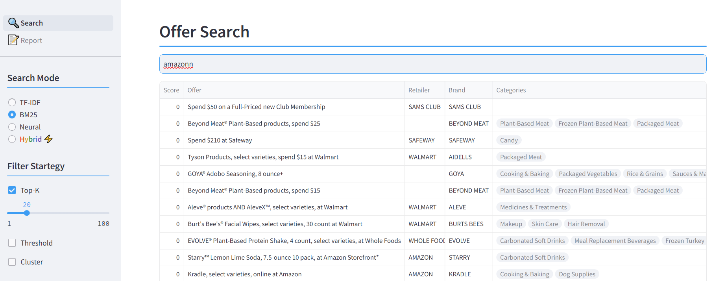
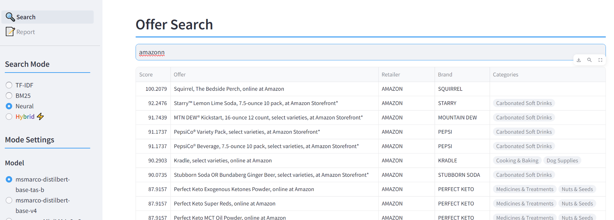

<div align="center">
    <div style="font-size:3rem; font-weight:600">Report</div>
    <div color="#3d9df3" style="border-radius: 3px; border:none; background-color: rgb(61, 157, 243); width:100%; margin-top: 0.5rem; margin-bottom: 2rem; font-size:0.1rem; color:background-color: rgb(61, 157, 243);">.</div>
</div>

## Outline
1. [Project Overview](#1-project-overview)
1. [Problem Statement](#2-problem-statement)
1. [Approach](#3-approach)
1. [App](#4-app)
1. [Results](#5-results)
1. [Discussion](#6-discussion)
1. [Improvement Scope](#7-improvement-scope)

<br>


## 1. Project Overview
The goal of this project was to build a tool that enables users to intelligently search for offers using text input. The tool is designed to enhance user experience within the Fetch app by providing relevant offers based on the user's search queries.

I approached the project with a strong emphasis on ensuring ease of deployment and scalability as key priorities. In this analysis report, I will detail the approach taken to address the problem, the data used, the preprocessing steps, the models and similarity scoring methods employed, the tool's deployment, and the results achieved.

<br>

## 2. Problem Statement

The primary objective of this project is to develop a text-based search tool that allows users to intelligently search for offers within the Fetch app. Users should be able to input text queries related to product categories, specific brands, or retailer names, and the tool should return a list of relevant offers, along with a score indicating the similarity between the user's input and each offer. The problem can be broken down into the following key components:

1. **Category Search:** When a user searches for a product category (e.g., "diapers"), the tool should retrieve a list of offers that are relevant to that specific category.

2. **Brand Search:** If a user searches for a particular brand (e.g., "Huggies"), the tool should provide a list of offers associated with that brand.

3. **Retailer Search:** Users may also search for offers available at a particular retailer (e.g., "Target"). The tool should return a list of offers that are relevant to that specific retailer.

4. **Similarity Scoring:** In addition to returning relevant offers, the tool should assign a score to each offer to measure the similarity between the user's input and the offer text.

The success of this project is contingent on the tool's ability to accurately identify and retrieve relevant offers, brands, and retailers based on user text input. Additionally, the similarity scores provided should assist users in quickly assessing the relevance of each returned offer.

<br>

## 3. Approach

In this section, I will outline my approach to solving the problem of enabling users to intelligently search for offers via text input, considering categories, brands, and retailers.

### 3.1 Data

For this task, I had access to three essential datasets:

1. **brand_category.csv**: This dataset consists of a mapping of brands to their respective categories, along with the number of receipts associated with each brand and category. In total, I was provided with 9,907 brand-category relationships.

2. **categories.csv**: This dataset provides information about categories and their relationships to super categories. There were 119 category-super category relationships provided.

3. **offer_retailer.csv**: This dataset contains information about various offers, including details about the associated brands and retailers. In total, I had access to 385 offers in this dataset.

### 3.2 Model and Algorithm

Different search methods and models were tested to achieve highest possible performance. The tool employs three distinct search methods to enhance the user's search experience:

#### 3.2.1 Keyword-Based Search

The tool offers keyword-based search using the following techniques:

- **TF-IDF (Term Frequency-Inverse Document Frequency)**: This method assesses the relevance of a keyword within an offer by considering its frequency within the offer text and its rarity across all offers. It's a traditional and widely-used information retrieval technique.

    $$IDF(t,D) = log\frac{|D|}{|\{d \in D:t \in d\}|}$$

    $$TF\text{-}IDF(t,d,D) = TF(t,d) \cdot IDF(t,D)$$

    where $TF(t,d)$ is the term frequency of term $t$ in document $d$, $|D|$ is the total number of documents in the collection, and $|\{d \in D:t \in d\}|$ is the number of documents containing the term $t$.


- **BM25 (Best Matching 25)**: BM25 is a probabilistic retrieval model that takes into account factors such as term frequency, document length, and collection statistics. It is effective for keyword-based searches and information retrieval.

    $$score(D, Q) = \sum_{t \in Q} idf(t) \frac{tf(t, D) \cdot (k_1+1)}{tf(t,D) + k_1 \cdot (1 - b + b \cdot \frac{|D|}{\text{avgdl}})}$$

    where $Q$ is the query, $tf(t, D)$ is the term frequency of term $t$ in document $D$, $k_1$ and $b$ are free parameters, and $\text{avgdl}$ is the average document length.


#### 3.2.2 Semantic Search

Semantic search is supported through the utilization of various pre-trained models:

- **BAAI/bge-base-en-v1.5**: Designed for semantic search, this model excels in comprehending text context, making it suitable for identifying offers contextually relevant to the user's input.

- **thenlper/gte-large**: Proficient in understanding the intricacies of natural language, this model provides an advanced approach to semantic search.

- **llmrails/ember-v1**: Ember-v1 is tailored for large-scale semantic matching tasks, making it valuable for matching user queries to pertinent offers.

- **thenlper/gte-base**: Suitable for general semantic search tasks, this model provides valuable insights into finding offers related to user input.

- **all-distilroberta-v1**: This model, based on DistilRoBERTa, excels in understanding the semantic context of text, which is valuable for semantic-based offer matching.

- **msmarco-distilbert-base-v4**: The MSMARCO (Microsoft Machine Reading Comprehension) DistilBERT model is particularly useful for search and retrieval tasks that require a deep understanding of query context.

- **msmarco-MiniLM-L-6-v3**: A compact yet efficient model based on MSMARCO, well-suited for semantic search and retrieval tasks.

- **msmarco-MiniLM-L-12-v3**: A larger version of the MSMARCO MiniLM model, designed for more complex semantic search tasks.

- **msmarco-distilbert-base-tas-b**: Specializing in textual entailment and semantic similarity, this model is ideal for precise matching of user queries to relevant offers.

#### 3.2.3 Hybrid Search

Hybrid search combines BM25 keyword-based search with neural models for enhanced performance. It involves combining scores from both approaches using different strategies:

- **Combination Strategies**: Scores from both models are combined using arithmetical mean, geometric mean, and harmonic mean.

    $$\text{Arithmetic Mean} = \frac{BM25Score + NeuralScore}{2}$$

    $$\text{Geometric Mean} = \sqrt[2]{(BM25Score \cdot NeuralScore)}$$

    $$\text{Harmonic Mean} = \frac{2}{\frac{1}{BM25Score} + \frac{1}{NeuralScore}}$$

- **Normalization**: Individual model scores are first normalized as they may be on different scales, and then they are combined using L2 Norm and Min-Max Scaling.

    $$\text{L2 Norm} = \sqrt{Score^2}$$

    $$\text{Min-Max Scaling} = \frac{Score - \min(Scores)}{\max(Scores) - \min(Scores)}$$


### 3.3 Scoring

To measure the similarity between user input and offers, I employed two metrics:

1. **Dot Product**:
    - The dot product is a straightforward metric that measures the similarity between two vectors by taking the sum of the products of their corresponding elements. In our case, these vectors represent the text embeddings of user input and offers.
    - Higher dot product values indicate greater similarity, as it quantifies the extent to which the vectors point in the same direction.

    $$\text{Dot Product (A, B)} = \ A \cdot B$$

1. **Cosine Similarity**:
    - Cosine similarity is a commonly used metric for measuring the similarity between two vectors, and it is particularly effective for text data. It calculates the cosine of the angle between the vectors in a high-dimensional space.
    - Cosine similarity values range from -1 (completely dissimilar) to 1 (completely similar), with 0 indicating orthogonality (no similarity). It's a widely adopted metric for comparing the direction of vectors, making it well-suited for text similarity.

    $$\text{Cosine Similarity (A, B)} = \frac{A \cdot B}{\sqrt{A^2} \cdot \sqrt{B^2}}$$

Both of these similarity metrics were used to evaluate the resemblance between the user's input and the offers. The higher the similarity score, the more relevant the offer is to the user's query.

However, it's important to note that for BM25, these scoring metrics do not apply, as BM25 employs its own scoring mechanism. In the case of TF-IDF (Term Frequency-Inverse Document Frequency), I have used the Dot Product as the scoring metric to evaluate relevance.

### 3.4 Filter Strategy

In order to enhance the user experience and streamline the search results, three distinct result filtering strategies were implemented:

1. **Top-k**: This strategy involves selecting the top-k most relevant results based on the similarity scores. Users can specify the number of results they wish to view, providing control over the output volume.

2. **Threshold**: With this strategy, results that meet or exceed a certain similarity score threshold are displayed. This allows users to filter out less relevant results, ensuring that only highly relevant offers are presented.

3. **Cluster**: Utilizing K-means clustering, I categorized the results into distinct clusters. For this implementation, two clusters were used, and the top cluster, which contains the most relevant results, was chosen to display to the user. This method helps users quickly identify the most relevant set of offers within the dataset.


### 3.5 Vector Store

Different vector storage techniques were employed for various search approaches:

#### Keyword-Based Search
For the keyword-based search, I utilized the following techniques:

- **TF-IDF**: Vectors representing the data were stored as .npz files, and the vectorizer was serialized and stored as a pickle file.

- **BM25**: Similar to TF-IDF, the BM25 vectors were stored as pickle files.

#### Semantic Search
For semantic search, I employed a different approach:

- **FAISS**: I implemented semantic search using the FAISS library from Facebook. FAISS is a highly efficient library for similarity search and clustering of dense vectors. It is particularly useful when dealing with high-dimensional data, such as embeddings generated from deep learning models. However, further details about the implementation can be provided as needed.

These vector storage techniques were chosen based on the specific requirements of the search method and the nature of the data, ensuring efficient and accurate retrieval of relevant information.


### 3.6 Preprocessing

Data preprocessing played a pivotal role in cleaning and organizing the datasets for effective analysis and modeling. The following steps were taken to preprocess the data:

#### 3.6.1 Data Preprocessing

- **Data Integration**: I merged the three datasets provided into a unified dataset to simplify subsequent analysis. This integrated dataset includes information related to offers, retailers, brands, categories, super categories, and a target variable used for modeling. The target variable was constructed by combining data from columns such as Offer, Retailer, Brand, Categories, and Super Categories. To ensure efficient data retrieval, this dataset was stored in a SQLite database. It's worth noting that for scalability, an alternative to SQLite, such as MySQL, can be seamlessly integrated by updating the database connection URL in the code.

#### 3.6.2 Text Preprocessing

Text preprocessing was applied to the target variable based on the specific search algorithm or model employed. Two primary approaches were considered:


##### 3.6.2.1 Keyword-Based Search:

- **Tokenization**: For keyword-based search, the text underwent tokenization to convert it into individual words and phrases. The following steps were followed for tokenization:

    - Special Character Removal: The input text is processed using a regular expression (re.sub) to substitute any characters that are not alphabets (a-z, A-Z) or digits (0-9) with a space. This step effectively removes special characters, punctuation, and symbols, leaving only letters and numbers.

    - Tokenization: The cleaned text is tokenized into individual words and phrases using the word_tokenize function. This step splits the text into a list of tokens, where each token represents a word or phrase.

    - Stemming: Stemming is applied to each token to reduce words to their root or base form. The PorterStemmer is used for this purpose. For example, words like "running" and "ran" might both be stemmed to "run."

    - Stop Word Removal: Common English stop words, such as "the," "and," "is," etc., are removed from the list of tokens. This step helps eliminate words that typically do not carry significant meaning in text analysis.

    - Code:
    ```python
    def tokenize(self, text: str):
        text = re.sub(r"[^a-zA-Z0-9\s]", " ", text)
        tokens = word_tokenize(text)
        ps = PorterStemmer()
        stop_words = set(stopwords.words("english"))
        tokens = [ps.stem(word) for word in tokens if not word in stop_words]
        return tokens
    ```


##### 3.6.1.2 Semantic Search:

- **Tokenization**: For semantic search, the target variable was tokenized using a model-specific tokenizer. The exact steps and tokenization strategy depended on the specific NLP model chosen for the task. This process is model-specific and may involve techniques like sentence tokenization and embedding-based approaches.

<br>

### 3.7 Evaluation

#### 3.7.1 Synthetic Data Generation

To assess the performance of the tool, a set of synthetic queries was generated for evaluation purposes. The process of synthetic data generation involved creating a collection of retailers, brands, categories, and super categories. This set served as the foundation for generating natural language queries.

The generation of synthetic queries was executed using OpenAI's GPT-3.5 Turbo model. Specifically, for each term within the set of retailers, brands, categories, and super categories, ten queries were generated. Additionally, each term was also considered as a query itself, resulting in a one-word query. This approach led to a total of 11 queries generated for each term within the set. Typos were introduced to queries to make keyword based models suffer.

A total of 3,333 synthetic queries were created, comprising a diverse range of terms, categories, and brands to evaluate the tool's effectiveness and accuracy.

#### 3.7.2 Metric

The evaluation of the tool's performance was conducted using the NDCG (Normalized Discounted Cumulative Gain) metric. NDCG is a metric commonly used to assess the quality of ranked search results, especially in information retrieval tasks. It provides a measure of how well the tool's ranking aligns with the relevance of the search results. Only Top 20 scores were considered to calculate the scores.

$$NDCG@20 = \frac{1}{Z} \sum_{i=1}^{20} \frac{2^{rel_i} - 1}{\log_2(i+1)}$$

Where:
- $NDCG@k$ is the NDCG score at a specific rank $k$.
- $rel_i$ is the relevance score of the item at rank $i$.
- $Z$ is a normalization factor to ensure values are between 0 and 1.
- $\log_2$ is the base-2 logarithm.

The NDCG metric takes into account the position of relevant results in the ranked list and assigns higher scores to relevant results appearing at the top of the list. This means that results highly relevant to a query receive higher scores, contributing to a more accurate assessment of the tool's performance.


## 4. App

For the deployment of the app, I developed a user-friendly web application using the Streamlit framework. This application provides an accessible interface for users to interact with the search functionality and retrieve relevant offers based on their text queries. The Streamlit app is designed to enhance the user experience and ensure that users can easily access the features and results of the tool.

### 4.1 Key Features of the App

The Streamlit app offers several important features that facilitate the user's search experience:

- **Search Modes**: Users can choose from different search modes, including TF-IDF, BM25, Neural, and Hybrid. This flexibility allows users to select the most suitable search approach based on their preferences and requirements.

- **Neural Model Selection**: For Neural and Hybrid search modes, users can select from a range of pre-trained models to fine-tune the semantic search. This allows users to tailor their search experience based on the model that aligns with their specific needs.

- **Search by Brands**: The application supports brand-specific search, enabling users to look for offers associated with a particular brand, such as "Huggies." This feature is particularly valuable for users who have brand preferences.

- **Combination Strategy**: Users can choose from various combination strategies, including arithmetical mean, geometric mean, and harmonic mean, to combine scores from different search models. This allows users to control how the final relevance score is calculated.

- **Normalization**: The application provides options for score normalization, including L2 normalization and Min-Max scaling. Users can select their preferred normalization strategy or choose to disable normalization.

- **Scoring Type**: Users can choose between two scoring types: Dot Product and Cosine Similarity. This selection influences how the similarity scores between user input and offers are calculated, offering users the flexibility to determine the relevance scoring method.

- **Filtering Strategy**: Users can select from different filtering strategies, such as top-k, threshold, and cluster, to control the number and type of results displayed. These filtering options help users fine-tune their search results to align with their preferences.


## 5. Results
In this section, I present the results of my analysis, including performance metrics and examples of successful searches.


### 5.1 Keyword-Based Search

#### 5.1.1 TFIDF

| Model                         | Dot Product   |
|-------------------------------|---------------|
| TF-IDF                        | 0.9114        |

<br>

#### 5.1.2 BM25

| Model                         | Score   |
|-------------------------------|---------------|
| BM25                          | 0.9027        |

<br>

### 5.2 Symantic Search
I evaluated different models for semantic search and their corresponding similarity scores are shown below.

| Model                         | Dot Product   | Cosine Similarity |
|-------------------------------|---------------|-------------------|
| BAAI/bge-base-en-v1.5         | 0.8575        | 0.8575            |
| thenlper/gte-large            | 0.8774        | 0.8774            |
| llmrails/ember-v1             | 0.8041        | 0.8434            |
| thenlper/gte-base             | 0.8844        | 0.8844            |
| all-distilroberta-v1          | 0.7206        | 0.7206            |
| msmarco-distilbert-base-v4    | 0.7506        | 0.7674            |
| msmarco-MiniLM-L-6-v3         | 0.6872        | 0.7588            |
| msmarco-MiniLM-L-12-v3        | 0.7377        | 0.7880            |
| **msmarco-distilbert-base-tas-b** | **0.9012**   | **0.8716**     |

<br>

### 5.3 Hybrid Search
I evaluated the results of Hybrid Search by combining neural models with the BM25 model. The best-performing model was **msmarco-distilbert-base-tas-b**.

| Mean Type          | Norm Type    | Score Type           | Score   |
|--------------------|--------------|----------------------|---------|
| **Arithmetic**     | **None**     | **Dot Product**      | **0.9444**  |
| Arithmetic         | None         | Cosine Similarity    | 0.9384  |
| Arithmetic         | L2           | Dot Product          | 0.9397  |
| Arithmetic         | L2           | Cosine Similarity    | 0.9384  |
| Arithmetic         | Min-Max      | Dot Product          | 0.9459  |
| Arithmetic         | Min-Max      | Cosine Similarity    | 0.9341  |
| Geometric          | None         | Dot Product          | 0.9057  |
| Geometric          | None         | Cosine Similarity    | 0.9038  |
| Geometric          | L2           | Dot Product          | 0.9057  |
| Geometric          | L2           | Cosine Similarity    | 0.9038  |
| Geometric          | Min-Max      | Dot Product          | 0.9126  |
| Geometric          | Min-Max      | Cosine Similarity    | 0.9054  |
| Harmonic           | None         | Dot Product          | 0.9035  |
| Harmonic           | None         | Cosine Similarity    | 0.9048  |
| Harmonic           | L2           | Dot Product          | 0.9102  |
| Harmonic           | L2           | Cosine Similarity    | 0.9055  |
| Harmonic           | Min-Max      | Dot Product          | 0.9127  |
| Harmonic           | Min-Max      | Cosine Similarity    | 0.9054  |

<br>

## 6. Discussion

I began by conducting thorough research on the Search and Retrieval problem. I initially implemented the TF-IDF model and subsequently progressed to the more advanced BM25 model. However, these models have inherent limitations as they primarily rely on keywords and may not fully capture the nuances of natural language. For example -

<br>



<br>

To address this limitation, I started experimenting with language models, as they excel in understanding semantics. Both search methods, keyword-based and semantic, offer unique strengths, prompting the exploration of a solution that combines their capabilities.

<br>



<br>
<br>

### 6.1 Conclusions
After extensive experimentation and evaluation, the following conclusions were drawn:

- Neural retrievers combined with BM25 demonstrate the best overall performance.
- When a query consists solely of keywords, BM25 and TF-IDF tend to outperform neural retrievers.
- Queries that contain natural language and potentially include typos are better served by neural retrievers over BM25 and TF-IDF.
- The optimal combination method for the search models was found to be arithmetic, which yielded the best results.
- Normalizing the scores had a detrimental effect on performance, indicating that certain models inherently possess different weights or importance.
- The choice of scoring type proved crucial, with some models performing optimally with the scoring method they were initially trained on.


<br>

## 7. Improvement Scope
While the tool demonstrates strong performance, there are areas for improvement:

-  **Reranking**: The incorporation of a reranking model after the retrieval model could further refine the relevance of search results.

- **Fine-tuning**: Fine-tuning the retrieval model presents an opportunity to improve performance. The tool can become more adept at providing highly relevant search results.

- **Query Database Expansion**: Expanding the query database with a more extensive collection of synthetic or real queries can be instrumental in fine-tuning the models. A diverse set of queries provides the model with a broader understanding of user intent and can result in more accurate and context-aware search outcomes.

- **Role Labeling and Advanced NLP**: Exploring advanced NLP techniques, such as semantic role labeling, offers the potential to enhance the tool's comprehension of user queries. By identifying the roles and relationships of words within a query, the tool can better understand the user's intent and deliver more precise results.

- **API Deployment**: Implementing FastAPI-style modules to swiftly establish an API for the search functionality. The codebase has been structured to facilitate API development, providing users with a flexible and accessible means of integrating the search tool into their applications.

- **Database and Scalability**: Exploring alternative databases or data storage solutions is crucial for ensuring scalability. Adapting the tool to handle larger volumes of data efficiently is essential for accommodating growing user demands and data requirements.
